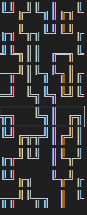

# WFC Path Generator

A Python implementation of the **Wave Function Collapse** algorithm that procedurally generates connected pipe/path patterns on a 2D grid using Unicode box-drawing characters.

## Output Example

## Usage

```bash
python wfc.py